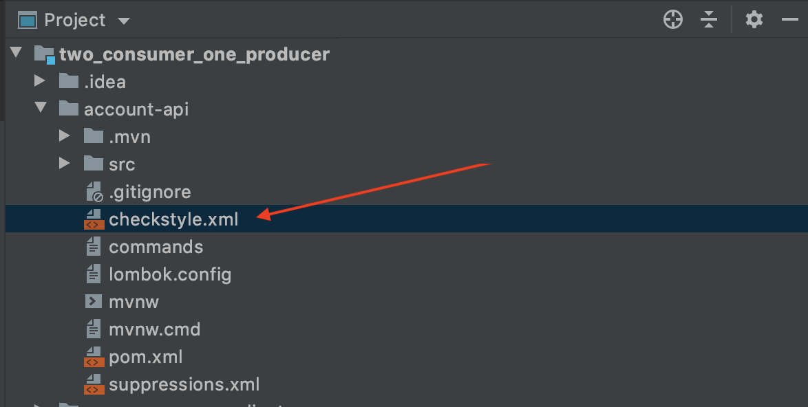
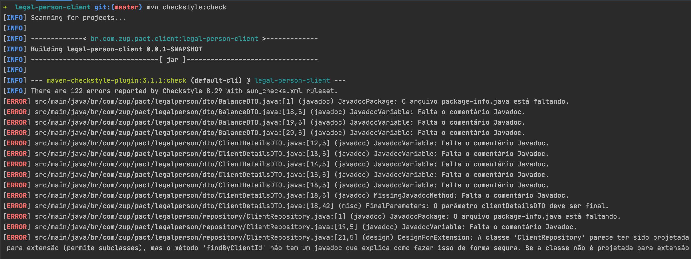

 
 
 ### Tópicos - ZUP Checkstyle

:small_blue_diamond: [Descrição do projeto](#descrição-do-projeto)

:small_blue_diamond: [Introdução](#introdução)

:small_blue_diamond: [Arquivo de Checkstyle](#arquivo-de-checkstyle)

:small_blue_diamond: [Pré-requisitos](#pré-requisitos)

:small_blue_diamond: [Configurar seu projeto para usar Checkstyle](#configurar-seu-projeto-para-usar-Checkstyle)

:small_blue_diamond: [Checando seu projeto com maven](#Checando-seu-projeto-com-maven)

:small_blue_diamond: [Artigos relevantes](#Artigos-relevantes)

:small_blue_diamond: [Outros Checkstyles](#outros-checkstyles)

 
# Descrição do projeto
Este projeto tem como objetivo servir todos Devs da Zup a implementaremn boas práticas de convenção de código em projetos Java. 
O checkstyle é uma ferramenta que auxilia seu projeto a seguir uma convenção de código configurada por desenvolvedores. 
O objetivo é garantir a legibilidade e fácil leitura e manutenção do código.

<p align="center">

 
 
 
 
 
 
</p>

## Introdução
Checkstyle é um analisador estático de código para checar se o código fonte está de acordo com as regras de codificação. Esta ferramenta de código fonte aberto ajuda nas boas práticas de programação na qual melhora-se a qualidade do código, re-usabilidade, clareza, entre outros fatores. O Checkstyle se preocupa com a apresentação do código, portanto não analisa se a lógica do seu código está correta.

É possível verificar, por exemplo:

- Comentários Javadoc;
- Códigos repetitivos;
- Número de Colunas (tamanho da linha);
- Cabeçalhos obrigatórios;
- Convenções nos nomes dos atributos e métodos;
- Limite no número de parâmetros;
- A utilização dos pacotes importados nas classes;
- Os espaços entre caracteres e entre operadores;
- Números mágicos;
- Boas práticas no desenvolvimento de classes e métodos;
- Código duplicado;
- E muitos mais detalhes e padrões.

Portanto, pode-se verificar que o Checkstyle garante que o seu código atende a padrões e que há um bom nível de codificação.


## Arquivo de Checkstyle

<a href="https://github.com/ZupIT/zup-checkstyle-java/blob/master/src/main/resources/checkstyle.xml">
/src/main/resources/checkstyle.xml
</a>


- Este é o arquivo que você fará download para seu projeto. Nos próximos tópicos abordaremos como configurar o checkstyle em seu projeto Java.
 
## Pré-requisitos

- Java 8+
- Maven 3+
- Um Projeto Java :smile:


## Configurar seu projeto para usar Checkstyle


Copie este arquivo para dentro do seu projeto:

https://github.com/ZupIT/zup-checkstyle-java/blob/master/src/main/resources/checkstyle.xml


Segue exemplo de como ele pode ficar dentro do seu projeto.
 - lembrando que voce pode criar um diretório exclusivo para armazenar o arquivo de checkstyle, contanto que esteja dentro do seu projeto.
 a localização exata dele será utilizada mais abaixo.
 
 


- Este arquivo fornece uma configuração padrão para o estilo de verificação de códigos da Zup.

### Configurando pom.xml (Maven):

Neste exemplo, vamos explorar a configuração do checkstyle com *Maven*.

Busque em seu arquivo *pom.xml* o trecho 
```
<properties>
...
</properties>
```
É possível que seu projeto não contenha o *<properties>*, neste caso voce pode adicionar, ele deve ficar na raiz do *pom.xml*, no mesmo nível do 
seu *<artifactId>* que define o id do seu artefato (projeto java).
 
Dentro de *<properties>*, adicione a chave para indicar a versão do plugin checkstyle para maven.
 
*<checkstyle-maven-plugin.version>3.1.1</checkstyle-maven-plugin.version>*
Em nosso caso, será a versão 3.1.1;

```
<properties>
    <checkstyle-maven-plugin.version>3.1.1</checkstyle-maven-plugin.version>
</properties>
```

Na sequência, procure pela área de *<build><plugins>* do seu *pom.xml* - Caso não exista, voce pode criar esta na raiz do seu *pom.xml* e adicionar conforme exemplo abaixo (Já configurando o plugin do checkstyle):

```
<build>
        <plugins>
            <plugin>
                <groupId>org.apache.maven.plugins</groupId>
                <artifactId>maven-checkstyle-plugin</artifactId>
                <version>${checkstyle-maven-plugin.version}</version>
                <executions>
                    <execution>
                        <id>validate</id>
                        <phase>validate</phase>
                        <configuration>
                            <configLocation>checkstyle.xml</configLocation>
                            <encoding>UTF-8</encoding>
                            <consoleOutput>true</consoleOutput>
                            <failsOnError>false</failsOnError>
                            <failOnViolation>true</failOnViolation>
                            <violationSeverity>warning</violationSeverity>
                        </configuration>
                        <goals>
                            <goal>check</goal>
                        </goals>
                    </execution>
                </executions>
            </plugin>
        </plugins>
    </build>
```
#### Explicação do plugin checkstyle para maven:

Para quem é chegado no Mave, voce pode notar que o plugin define um novo Goal (mojo) chamado de *<goal>check</goal>*, este goal vai ser executado durante a fase de validação do build do projeto, definido na tag *<phase>validate</phase>*, ou seja durante a validação, ele fará a checagem do código usando o arquiovo de checkstyle definido pela chave `<configLocation>checkstyle.xml</configLocation>`.
- Note que a chave *<configLocation>* aponta para o arquivo checkstyle.xml, que em nosso exemplo está na raiz do projeto, se estivesse em um diretório mais interno, devemos usar um caminho relativo (sem barras no inicio) para indicar onde o arquivo *checkstyle.xml* se encontra em nosso projeto.
 
Na sequencia do *<configLocation>* podemos ver outras tags importantes que informam o comportamento do plugin checkstyle ao analisar nosso código:

`<consoleOutput>true</consoleOutput>`
- Informa que ele deve imprimir no console o resultado da chacagem.

`<failsOnError>false</failsOnError>`
- Informa que se caso de *Erros* durante a checagem de estilo, o plugin deve impedir o build do projeto até que o código seja ajustado.

`<failOnViolation>true</failOnViolation>`
- Informa que se caso de *Violações* de estilo, o plugin deve impedir o build do projeto até que o código seja ajustado.

`<violationSeverity>warning</violationSeverity>`
- Define qual o nível de severidade para *Violações* de estilo, e este nível define diretamente se a configuração da tag `<failOnViolation>true</failOnViolation>` impedirá ou não o build.
<a href="https://maven.apache.org/plugins/maven-checkstyle-plugin/check-mojo.html#violationSeverity"> Outros Níveis </a>

### Relátorios do Checkstyle

Na mesma linha do plugin maven, é possível configurar como a execução do plugin deve gerar relatórios no console ou na sua IDE.
Para isso, basta incluir na raiz do seu *pom.xml* a seguinte configuração, note que ela contém a maioria das tags também definidas no plugin do checkstyle maven para o build da aplicação.

```
<reporting>
        <plugins>
            <plugin>
                <groupId>org.apache.maven.plugins</groupId>
                <artifactId>maven-checkstyle-plugin</artifactId>
                <version>3.1.1</version>
                <configuration>
                    <configLocation>${project.basedir}/checkstyle.xml</configLocation>
                    <encoding>UTF-8</encoding>
                    <consoleOutput>true</consoleOutput>
                    <failsOnError>true</failsOnError>
                    <linkXRef>true</linkXRef>
                    <failOnViolation>true</failOnViolation>
                    <enableFilesSummary>true</enableFilesSummary>
                </configuration>
            </plugin>
        </plugins>
    </reporting>
 ````
Com isso, voce está pronto para garantir que seu código sempre estará de acordo com a convenção de código adotada por nós Zuppers.


Para mais detalhes sobre o plugin maven, confira <a href="https://maven.apache.org/plugins/maven-checkstyle-plugin">aqui</a>

## Checando seu projeto com maven

Para rodar a checagem do seu projeto, basta usar o comando via maven a seguir:

```
# mvn checkstyle:check
```

- Feito isto... se projeto estiver 100% o relatório não trará nenhum resutado além da informação de sucesso.

- Em caso de violações do checkstyle por seu código, será exibido um relatório como este:




## Artigos relevantes

 - [Java com Checkstyle](https://www.devmedia.com.br/java-com-checkstyle/26043)
 - [How to Centralize your Checkstyle Configuration with Maven](https://codeburst.io/how-to-centralize-your-checkstyle-configuration-with-maven-7575eacd7295)


### Mais Checkstyles:
- https://github.com/singhalkul/java-quality-checks/blob/master/config/checkstyle/checkstyle.xml
